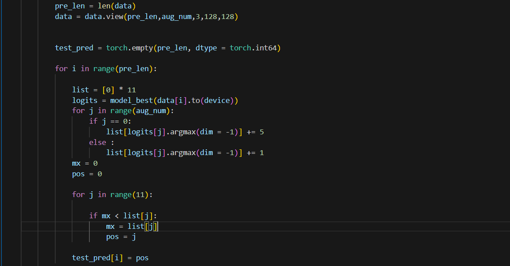
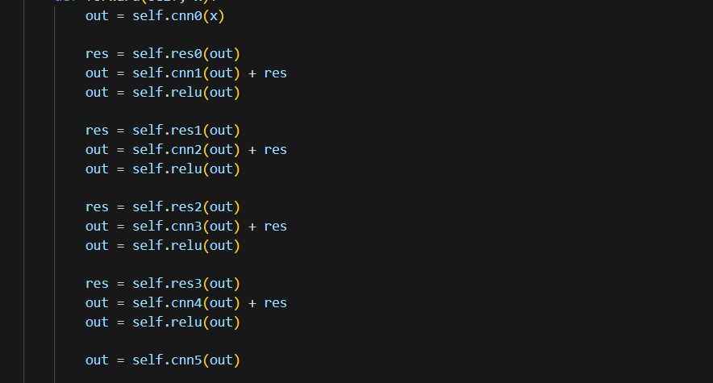

# 作业三思路

## 作业三是用卷积神经网络做一个图像分类。

### Easy 
直接跑给的源代码既可以达到要求。

### Medium
1. 增加epochs的次数。
2. 需要做一个数据增强。具体就是在载入数据的时候给每个图片生成不同的版本，增强泛化性。具体实现如下：

同时，在训练的代码块中，添加以下代码，用一张图片生成五张不同的图片：

3. 学习率从0.0003调整为0.0001

**private**: 0.715  
**public**: 0.745

### Hard
1. 使用多种变换方法，增强图片的多样性。

2. 再次增加epochs的次数。

3. **经验总结**
    1) 这几天的代码改写学到了很多东西，如dataloader类中的__getitem__()方法在如下图的所示代码区域才会被调用
        
    2) 学习到了张量的各种变换方法。
    3) 对于出现的各种报错也大概知道是哪里的问题。
    4) 初步了解到梯度爆炸和梯度截断，但**并没有深入了解**。
    5) 训练模型真的非常耗时，30h都验证不了几次想法。

**private**: 0.803  
**public**: 0.820

4. 使用TTA(Test Time Augmentation)，可以过双StrongLine

5. 使用ResNet，加深网络深度且不容易过拟合

**private**: 0.827
**public**: 0.822

### Boss