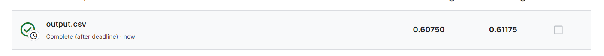
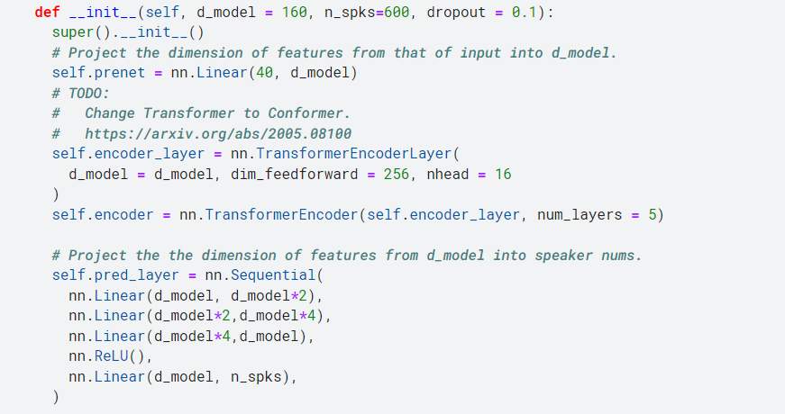
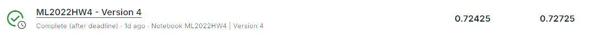
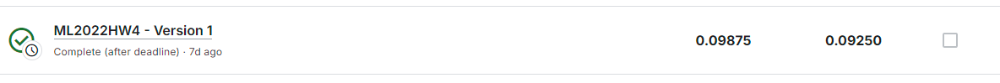
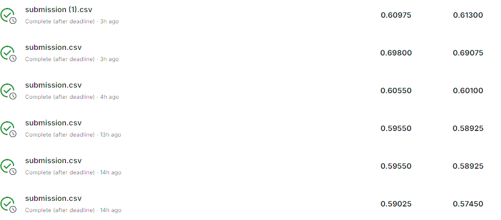
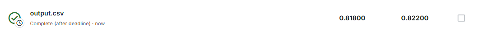

# 作业四思路

## Easy Line
跑一下sample code就能达到要求，主要是熟悉code结构，理清逻辑。

## Medium Line

先理解它的网络架构

1. 第一层是一个线性层
2. 第二层是多个Transformer的Encoder架构
3. 第三层也是多个线性层，进行说话人员的预测

将Sample Code的Transformer架构中变复杂，再进行预测，即可通过Medium Line

## Strong Line
### 最痛苦的一集，想自己实现一个Conformer，结果处处碰壁，最后还是看源码解决了问题。

#### Conformer的原文不难读懂，但我自己实现的过程我踩了很多坑。下面一一举例。

1. Conformer中的卷积层处理的应该是，不同token的同一维度的值。
我之前一直是认为处理的是一个token不同维度的值，效果一直不好，反复搞了几天，其中也出现过希望。  
其中训练集准确率100%，验证集90%，但出现了严重的过拟合，准确率只有72%。

这个最大的问题就是怎么处理测试集的token长度，如果按照训练集那样裁剪128维，得到的结果是如下这样：

所以我跟作业三对测试集的处理方式相同，也是使用TTA技术将一个测试数据分成多段来进行预测，但是效果一般，不如预测图片的效果那么明显。

2. 最主要的问题应该是Self-Attention的实现，我使用Pytorch写好的库效果非常差。虽然训练30000轮就达到了90%的验证准确率，但测试集不足60%。

3. 在Conformer的源码中抄了实现Self-Attention的代码，测试集准确率瞬间飙升，达到了80%

再经过一些参数微调，可以上升一些些，但还是有少许的过拟合，一直这样调整参数也没什么意义，就这样吧。

## 总结
### 这次作业做的非常痛苦，但也学到了非常多的东西。
1. 了解了Conformer的源码，但对Self-Attention架构理解还不深，导致模型出现了严重的过拟合，折腾了几天。  
2. 对Pytorch的各种向量操作方法了解地更多了。
3. 对卷积层的理解更深了。
4. 总的来说，这次作业还是获益匪浅的。
