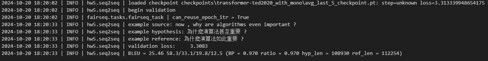
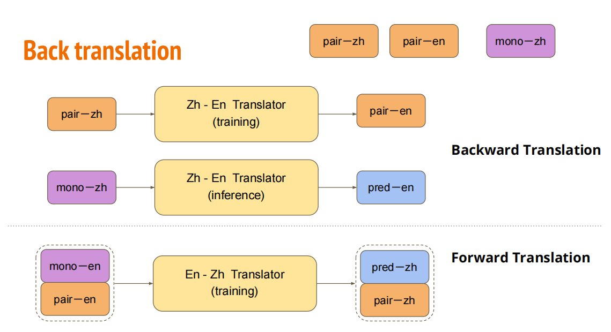
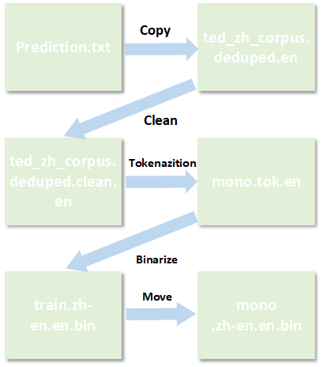
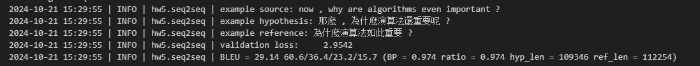

# 作业五思路
**说明：这次作业不像之前作业在Kaggle上提交，它只能在台大内部网站上提交。于是，我只能通过看Vaild  Dataste的BELU得分来看模型训练得怎么样**
## Base Line
只要跑样例给的代码就行，感觉主要难点在下载数据集和配置环境。 
还有一个重要的点：就是本次给的样例代码可学习的地方非常多，需要仔细研读代码。**这个作业使用的Transformer的源码没有阅读。**
## Medium Line
按照给的教程，调大epoch即可。

## Strong Line
这个我按照它给的教程无法达到预期Strong line。没办法，只能寄希望于Boss line才要用的**Back Translation**。  

Back Translation这也是这次作业的一个重点内容，下面将详细讲述：

- Back Translation可以说是一种半监督学习，以英译中的任务来举例，它需要一部分已经配好对的中英文资料，然后在网上爬取大量的中文资料，接着用已有的配对资料去训练一个中译英模型，用这个模型去翻译中文资料，产生大量的英文资料。 
此时，我们认为这也是一笔配对的资料，最后我们再用这两笔配对的资料去训练英译中的模型，以达到更好的效果。

具体代码上的操作过程有以下几步：

1. 我用的是自己的电脑跑到作业，所以会有Linux和Windows的语言风格转换问题，这个很好解决，用AI模型翻译一下即可。
2. 关于mono_data的英文资料，中译英模型翻译mono_data的中文资料产生的英文资料会在prediction.txt中，我们需要按照作业给的处理文本的流程将这个英文资料同时处理一遍。处理流程大概如下图所示，就以这个英文的资料来举例：

## Boss Line
自己看了一下attention is all you need 的原文，发现作业中用的架构和论文里的似乎一样，于是我将作业里的超参数换成了论文的超参数，并且在4060 Ti上跑了将近7个小时，最终达到了Boss line，如图所示：

## 总结
1. 这次作业代码量很大，但是很多代码都是对文本的预处理，理解起来不是很困难。
2. lr scheduling在这一次作业再一次出现，这个技术对与模型的稳定性很有好处，可以去网上找一些相关的资料。
3. 这次作业的架构很清晰，是个可以学习的对象。
4. 这次作业使用了RNN的架构（用了GRU实现），RNN可以不用花太多时间去理解，因为Self-Attention可以平位替代。
5. 要去重点理解使用Self-Attention架构的Transformer的源码。 

